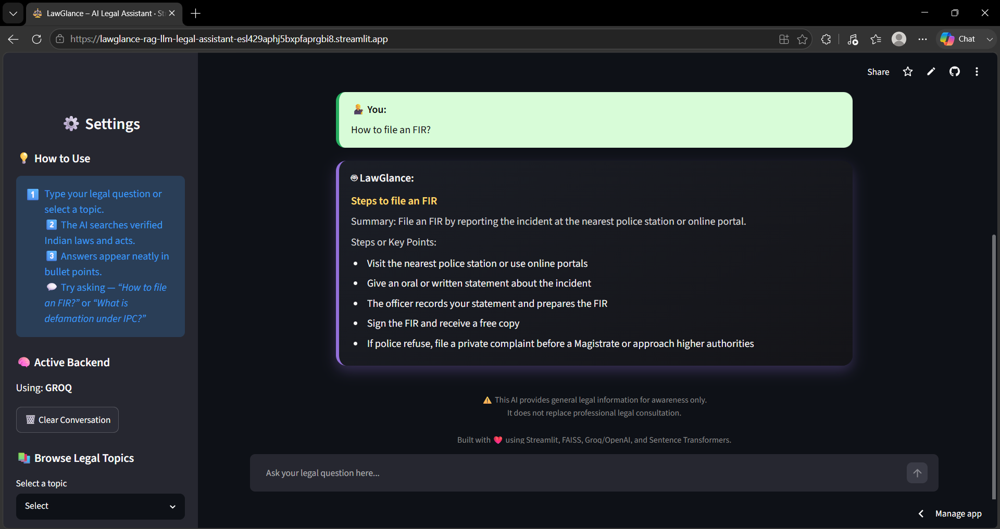

# ⚖️ LawGlance – RAG LLM Legal Assistant

An AI-powered legal assistant built with Retrieval-Augmented Generation (RAG) and Large Language Models to simplify Indian law understanding for everyone.

---

## 🧭 Overview

LawGlance is a Retrieval-Augmented Generation (RAG)-based AI Legal Assistant designed to help common people easily understand basic Indian laws — including Consumer Protection, Cyber Law, Motor Vehicle Act, IT Act, and Fundamental Rights.

This intelligent chatbot retrieves relevant sections from verified legal texts and generates structured, point-wise explanations using **Groq (llama-3.3-70b)** — presented through a sleek, gold-accented Streamlit interface.

---
## 🌐 Live Demo

The application is hosted on **Streamlit Cloud** and can be accessed here:
🔗 [LawGlance – Live App](https://lawglance-rag-llm-legal-assistant-esl429aphj5bxpfaprgbi8.streamlit.app)

## 🎥 Project Demo

🎬 Watch the demo video here: 🔗 [LawGlance Demo (Google Drive)](https://drive.google.com/file/d/1vUuFyrsY0plT6H7qWBEIT60qLRIqScLw/view?usp=drive_link)

## 📸 Screenshots




---

## 🚀 Features

✅ **Natural Language Q&A:** Ask legal questions like:
- "How to file an FIR?"
- "Explain Article 21 of the Constitution."

✅ **Structured Responses:** Answers are organized with a summary and key points for easy understanding.

✅ **RAG-based Context Retrieval:** Fetches the most relevant sections from Indian legal documents using FAISS before generating an answer.

✅ **Groq-Powered Backend:** Uses 🧠 Groq (`llama-3.3-70b`) for fast, accurate responses.

✅ **Modern Streamlit UI:** Sleek dark theme with glowing gold accents and a floating law icon.

✅ **Topic Explorer:** Browse through legal categories such as:
- Fundamental Rights
- Cyber Law
- Consumer Protection
- Labor Law

✅ **Context Management:** Clear chat and control retrieval depth for focused or broader responses.

---

## 🧠 Tech Stack

| Component | Technology Used |
|-----------|----------------|
| Frontend / UI | Streamlit |
| Embeddings | Sentence Transformers (`all-MiniLM-L6-v2`) |
| Vector Store | FAISS |
| Model Backend | Groq (`llama-3.3-70b`) |
| Environment Variables | `.env` (for API keys) |
| Styling | Custom CSS (Dark theme + Animated gold law icon) |
| Hosting (Optional) | Ngrok / Render / Hugging Face Spaces |

---

## 📁 Project Structure
```text
LawGlance-RAG-LLM-Legal-Assistant/
│
├── data/              # Legal text data (Consumer, IT, Labor, etc.)
├── src/
│   ├── chatbot.py     # Core chatbot logic (RAG + LLM)
│   ├── ingest.py      # Builds FAISS index from data
│   └── utils.py       # Helper and environment utilities
├── faiss_index/       # Saved vector index files
├── app.py             # Streamlit app for user interface
├── requirements.txt   # Dependencies
├── .env               # Environment variable template
└── README.md          # Project documentation
```
---

## ⚙️ Setup Instructions

### 1️⃣ Clone the Repository
```bash
git clone https://github.com/keerthana12hv/LawGlance-RAG-LLM-Legal-Assistant.git
cd LawGlance-RAG-LLM-Legal-Assistant
```

### 2️⃣ Create a Virtual Environment
```bash
python -m venv venv
source venv/bin/activate    # For Linux/Mac
venv\Scripts\activate       # For Windows
```

### 3️⃣ Install Dependencies
```bash
pip install -r requirements.txt
```

### 4️⃣ Add Your API Keys
Create a `.env` file in the root directory: 
GROQ_API_KEY=your_groq_api_key

### 5️⃣ Build the FAISS Index
```bash
python src/ingest.py --data-dir data --index-path ./faiss_index
```

### 6️⃣ Run the App
```bash
streamlit run app.py
```
The app will open at `http://localhost:8501`

---

## 💬 Example Questions

🧾 Try these sample queries during your demo:

- What are Fundamental Rights?
- How to file an FIR?
- Explain Article 21 of the Indian Constitution.
- What is bail?
- What is the difference between bailable and non-bailable offenses?
- What are punishments for cyberbullying?
- What is PIL?
- What are legal protections against workplace discrimination?

---

## 🧾 Example Output Format

**Title:** Steps to File an FIR

**Summary:** To file an FIR, visit the nearest police station or file online.

**Key Points:**
1. Visit the nearest police station or online portal.
2. Provide a detailed statement of the incident.
3. The officer records and prepares the FIR.
4. Sign and collect your free copy.
5. If refused, file a private complaint before a Magistrate (Sec. 156(3) CrPC).

---

## 🧱 Built With

❤️ Streamlit • 🧠 FAISS • ⚡ Groq • 📘 SentenceTransformers

---

## 👩‍💻 Developer

**J Keerthana**
📧 jkeerthana925@gmail.com
🔗 [GitHub Profile](https://github.com/keerthana12hv)

---

## ⚠️ Disclaimer

This AI assistant provides general legal information for awareness purposes only. It does not replace professional legal consultation or certified legal advice.

---

## 📜 License

This project is licensed under the **Apache 2.0 License**. You are free to use, modify, and distribute this code with proper attribution.
